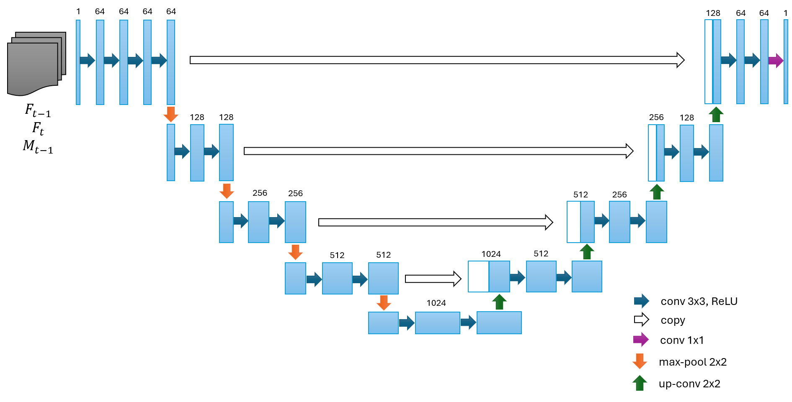
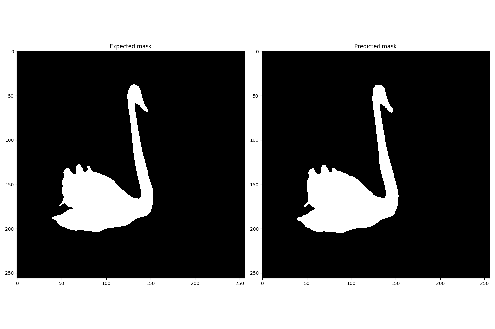
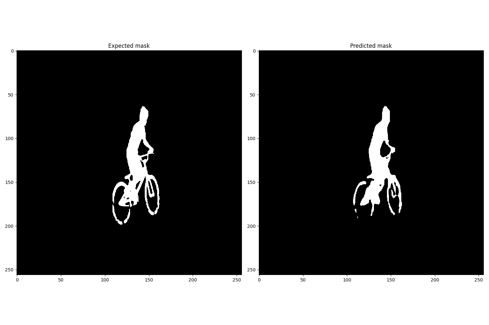

# Segmentation tracking in video

Project Description: The goal is to label an object in one frame of a video and let the algorithm track the exact shape of the object in subsequent frames.

## Setting Up a Python Environment

Optional: Create a Python virtual environment for the project to manage dependencies.

```bash
cd <project>
python -m venv myenv
source myenv/bin/activate
```

## Installing Dependencies

Optional: Install the required Python packages from the requirements.txt file.

```bash
pip install -r requirements.txt
```

## DAVIS2016 Dataset

For training, validation and testing we used A Benchmark Dataset and Evaluation Methodology for Video Object Segmentation\* [DAVIS](https://davischallenge.org/index.html), which is a widely recognized dataset in the field of computer vision, particularly in the area of video object segmentation. It provides a set of high-quality, full-resolution video sequences that are densely annotated for the task of video object segmentation, serving as a benchmark for evaluating algorithms in this domain.

For evaluation we are using Jaccard index, F-score and their mean.

## Train model

Run the training script with optional arguments for the dataset root directory and number of epochs. By default, the dataset root directory is set to ./DAVIS, and epochs are set to 32.

```bash
python train_gpu.py --dataset-root <dataset_root_dir> --output-pth <.pth model name> --epochs <epochs> [--resume <.pth model file>]
```

During training, you can monitor hyperparameters by watching `<.pth model name>_loss.png`, which is updated after each epoch.

## Baseline solution

### Model architecture

Our foundational model utilizes a customized U-Net architecture tailored for object segmentation. But we slightly adjusted the architecture to enhance its performance for video object segmentation. Among various architectures tested, this modified version of U-Net achieved the best evaluation scores, marking it as our superior choice for baseline model.



### Baseline evaluation

We assessed our trained U-Net model using our `eval.py` script and obtained the following results:

```
------------------------------
Statistics      |      Value
------------------------------
J mean          |     37.16 %
F mean          |     41.91 %
J&F mean        |     39.53 %
------------------------------
```

### Baseline perfmormance

In this section, we present two .mp4 video clips that illustrate the capabilities and limitations of our model using sequences from the DAVIS2016 dataset.

#### Successful Segmentation

The first video showcases a scenario where our model excels, effectively segmenting the object of interest from the background. This demonstration highlights the model's accuracy and its ability to understand slow scenes, distinguishing the main subject with quite accurate precision.



#### Limitations in Segmentation

Conversely, the second video reveals a situation where our model faces challenges.


## Acknowledgments

This project incorporates code from "A Benchmark Dataset and Evaluation Methodology for Video Object Segmentation" by Federico Perazzi, available under the BSD License. The original code is used for [describe purpose, e.g., boundary measures evaluation], and can be found at: https://github.com/davisvideochallenge/davis/blob/master/python/lib/davis/measures/f_boundary.py
